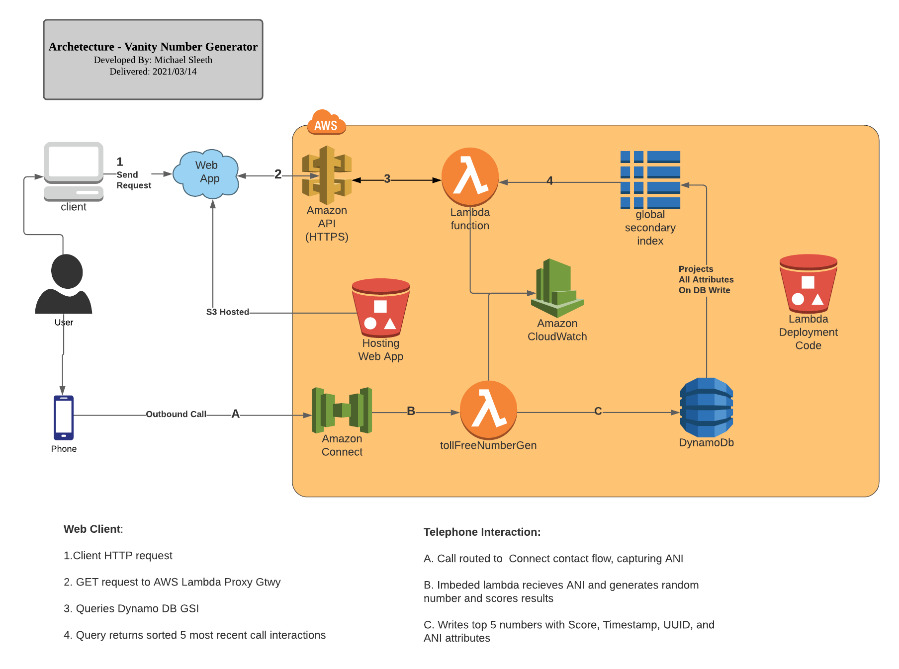

# Re-Rolodex

## Overview

Provides a call center that converts phone numbers to vanity numbers and saves the "Best" 5
resulting vanity numbers, score, and the caller's number in a DynamoDB table.

_Best_ = Defined as greater variation of digits == harder to remember.  
 _Score_ = unique digits of original number - unique digits of vanity number. Positive score represents better derived vanity number.
_algorithm_ = a random shuffle of phone digit order is then seeded with algorithm of digit value divided by index (d/i) and spread over number range 0 - 9 to derive new value.

## Archetecture Design


## Prerequisites

- Set up [awscli](https://docs.aws.amazon.com/cli/latest/userguide/cli-chap-install.html) on deployment machine.
- Bash shell (If on windows, can use [WSL](https://docs.microsoft.com/en-us/windows/wsl/install-win10))

## Deploy 

1. Update deploy params:
  
      a. Cd into the cloudfn/ directory

      b. Open in `conf-code-bucket.json` file and specify parameters for `code-bucket` name for the code bucket in deploy target enviroment.

      - (Optional) - Specify other specifc environment var in `conf-resources.json` to meet anticipated load demands. 

2. Use bash shell to execute deployments, specifying flags.
    
    a. Code Bucket -  specify two flags in order like:
      ```bash 
      bash deployCodeBucket.sh <create-stack OR update-stack> <awscli-profile-name>
      ```
    
    b.  Resources - After verifying bucket deployed successfully, run below specifying additional flag of the verified bucket name from above.
      ```bash
      bash deployResources.sh <create-stack OR update-stack> <bucketname> <awscli-profile-name> 
      ```

3. Amazon Connect Contact-flows:

   a. Add the created lambda resource "randomTollFreeGen" in the Amazon Connect panel by navigating to `AWS Connect service > Contact flows > AWSLambda` in AWS Console
   
   b. Import the contact flow in the `call-center-flows` directory to your Connect Instance.
   Instructions can be found [here](https://docs.aws.amazon.com/connect/latest/adminguide/contact-flow-import-export.html).

   c. In the Connect console, aquire a new number or repoint an existing one to the imported contact flow. 


4. Web App:

    a. In AWS CloudFormation service, open stack>randomTollFreeGen-rolodex>Outputs and copy the value for Key: `ApiGatewayInvokeURL`

    b. open `package.json` and under scripts (`deploy-dev-s3` and `upload-ui`): replace `bucket-name` and aws cli `profile_name`

    c. cd into directory `rolodex-ui`

    d. In terminal, run:
    ```terminal
     bash insert-app-vars.sh <Your_ApiGatewayInvokeURL_Value>
     npm install
     npm run deploy-dev-s3 (once complete, then below)
     npm run deploy-app
     ```
## Usage

- Dial phone number configured to uploaded contact flow
- Find the Web-App url by navigating to: AWS Console > S3 > Bucket > Properties > Static Website Hosting > Endpoint OR Cloudformation Stack Output
## Challenges/Learning during development
- #### Portable Deployment:

  Not knowing clients environment required for portability reqs.

  - _Considered_: - Considered wrapping in a python script to take in and build/run/manage deployment of resources from single config file
  - **Implemented**: Deployment by running two shell scripts after entering parameters in config files. (Little Clunky and curious of alternate methods!).

- #### DBs

  1. _Considered_ - Using scan can be efficient for returning last 5 entries into table. (Relational dbs excel for these query types) Scaning doesn't scale well in cost and performance. Using a ttl can help reduce this and mitigate this by reducing records in table to a relavent set. Considerations need to be made like:

      - size fluctuations based on user load variances over time
      - what to do with expired data. (DynamoStreams to cold storage on insert etc.)

  2. _Considered_ - Using a partition key of yyyy-mm-dd and sort key. Can pull data from subsets to avoid large calls/scans. Limitation, multiple calls "polling for data"

  3. **Implemented** - A table holding all calldata with generated uuid partition key on insert, with additional 'partition' attribute . GSI (Global Secondary Index) with 'partition' attr as partition key and Sort key with DateTime

      - partitioning key allows for 'scatter-gather' technique to scale as data increases
      - Sort key allows for retrieval of sorted data by posix datetime value
      - uuid projected to GSI allows to be used as key ids in react jsx elements

- #### React

  - Use of React functional components with useEffect to keep asyncronous api calls from updating state before promise fulfillment

## Production/Customer Readiness

- Gateway Auth mechanism: Telephone numbers are considered PII, so authorization needed. Authentication as well as current state endpoint is exposed to even the most basic DDOS attack.
- Testing: Robust testing files needed for resources/app as well as portability so client can integrate with CI/CD
- Add security cert to app, control api headers to allow access control to named hosts only, and ui responsiveness improved.
- Echo client environment resources in terminal outputs after generated (ex: app url) for easy customer validation

## Future Enhancements

- python controller for deploy/template management and generation vs. the implemented bash commands
- Lexbot asking user number of cycles to run vanity number algorithm for "better" number results (Premium feature)
- On calling, offer to send link to customers phone via SMS message 